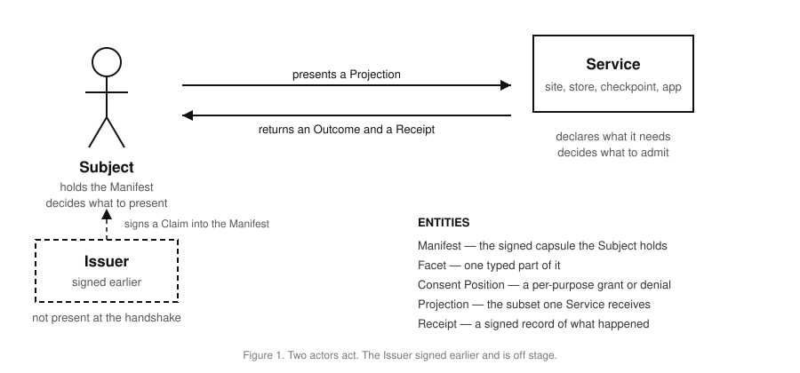
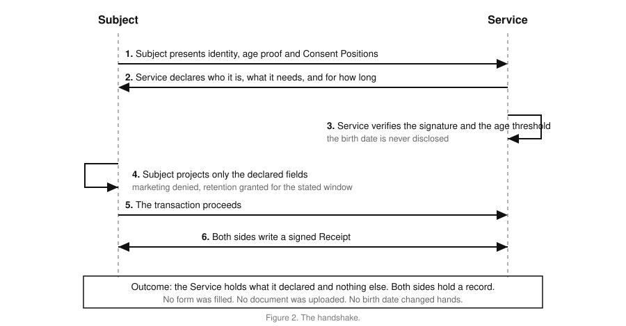
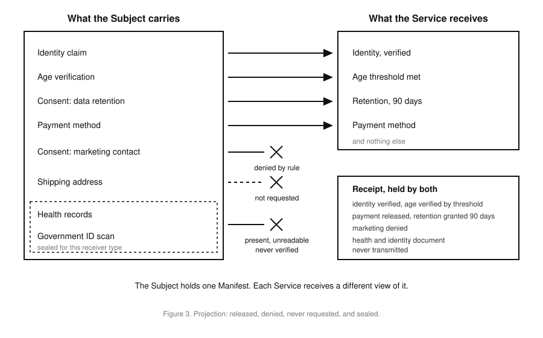

# Universal Manifest: Permissions and Handshaking
# OMA3 Technical Working Group (TWG)

## Introduction

This document defines the Permissions and Handshaking use case for the Universal Manifest (UM). Permissions and Handshaking is the exchange the other nine use cases stand on. Portaling, smart homes, smart glasses, health, credentials and agent transactions each add detail, but underneath they run this handshake.

Today every interaction starts from zero. Every site asks the same questions in different ways. Every form asks for the address again. Every checkpoint photocopies the identity document. People click accept-all because the alternative is twenty minutes of toggle hunting.

With a manifest, Subject sets the rules once. Bank gets enough to lend. Bouncer gets nothing beyond an age threshold. Hotel abroad gets enough to check in and keeps no scan of a passport.

## Purpose

The purpose of this document is to state the requirements for Permissions and Handshaking in a form the working group can review, amend and vote on. The requirements are the measuring stick.

## Scope

This document covers a single encounter between two parties: the exchange of manifests, what Service declares it needs, what Subject releases, what Subject withholds, and the record both sides keep.

It does not cover transport, storage, account systems, or the credential formats the manifest carries. It does not describe architecture. Architecture belongs in proposals answering these requirements.

## Use Cases

Use cases capture the main objectives of a system. A use case driven process identifies the main actors and determines how those actors interact with the system. An actor is an entity outside the system that interacts with it.

There are two components of a use case definition: the system and the actors.

### System

The System is the Universal Manifest: the signed document, the sequence a receiver runs against it, the rules that decide what a given receiver sees, the consent model, and the receipt both parties produce.

The System does not include the services, the network between them, the payment rails, or the credential issuers. Those are actors.

### Actors

  * Subject- The person the manifest describes. Holds the Manifest, sets the rules, decides what to present.
  * Service- The party Subject meets. A site, a store, a checkpoint, an application. Declares what it needs and decides whether to proceed.
  * Issuer- Signed a claim into the Manifest earlier. Not present at the handshake.
  * Manifest- The signed capsule Subject holds.
  * Facet- One typed part of the Manifest.
  * Consent Position- A grant or a denial, bound to a purpose.
  * Projection- The subset of the Manifest one Service receives.
  * Receipt- A signed record of what was verified, released, refused, and left unreadable.

### Permissions and Handshaking Use Case

  1. Subject opens a site or walks into a store. Subject and Service exchange manifests. Service declares what it needs for this transaction before anything else happens.
  2. Service verifies the identity claim, and confirms the age threshold against Issuer's signature without seeing a birth date.
  3. Subject releases the payment method. Subject's rule denies marketing contact. Subject grants data retention within a ninety day window.
  4. Shipping address is available but not required, so it never crosses.
  5. Health record and identity document scan are sealed and unreadable to a Service of this kind. Service records them as present and unreadable, not as verified.
  6. The transaction proceeds. Subject filled in no form, clicked through no banner, and uploaded no document.
  7. Both parties write a signed Receipt.
  8. Optional- Subject withdraws a grant later. Service stops relying on it and the withdrawal joins the record.

## Threat Model

Documenting how a handshake fails matters as much as documenting how it works. This section gives a high level analysis of the ways the exchange can be attacked, misused, or go wrong.

### Over-collection

Service asks for more than the transaction needs, because asking is free and refusing is awkward. Service reads a field it never declared. Service elicits an available field by asking broadly rather than specifically. Each requested field looks unremarkable on its own, and the combination identifies one person.

### Consent that drifts

A grant given for one purpose is reused for another. A grant given for ninety days is kept for a year. A denial is treated as an absence, and then as a yes.

### False verification

Service claims to have verified something it could not read. A sealed field is reported as checked. An unverified claim is passed to a third party as verified.

### Downgrade

Service asks for a more revealing form than the transaction requires and Subject's client complies quietly. The cleartext date is demanded where a threshold proof would do.

### Correlation

Two services compare notes and determine they met the same person. A service and an issuer compare notes and determine where Subject went. A value carried in a signature, a proof, a status check, a challenge, or a receipt acts as a join key across encounters. Two services present the same self-asserted name and collapse Subject's separate disclosures into one. A field fetched by reference rather than carried gives the same address to every service, and shows the host who retrieved it.

### Replay

A presentation is captured and replayed. A challenge supplied by Service is reused across services, or carries a structure that turns it into a tracking value.

## Requirements

The following requirements are derived from the use case and threat model above. They use SHALL, SHOULD and MAY as defined in RFC 2119.

### 1. Consent Requirements

#### 1.1. UM SHALL allow consent to be granted or denied independently per purpose, so that answering one question does not answer another.

#### 1.2. UM SHALL resolve a denied or missing field deterministically, either by proceeding without it or by declining, and SHALL NOT allow Service to proceed as though it were granted.

#### 1.3. UM SHALL bind a grant to the purpose and retention window Service stated, and SHALL treat reuse for another purpose or retention past the window as a violation.

#### 1.4. UM SHALL allow Subject to withdraw a grant after the handshake, and SHALL require Service to stop relying on it.

### 2. Disclosure Requirements

#### 2.1. UM SHALL require Service to declare the fields it needs before Subject presents, and SHALL NOT allow Service to read outside that declared set.

#### 2.2. UM SHALL NOT transmit a field that was not requested.

#### 2.3. UM SHALL NOT allow Service to obtain an unrequested field by asking broadly.

#### 2.4. UM SHALL allow Subject to reduce or refuse a requested combination that identifies Subject, since Service authors the request.

#### 2.5. UM SHALL allow Subject to refuse a more revealing form than Subject's own floor, rather than disclosing below it.

### 3. Verification Requirements

#### 3.1. UM SHALL allow an age check to be answered as a threshold without disclosing the underlying date.

#### 3.2. UM SHALL keep a sealed field unreadable to a receiver outside the authorized kind, and SHALL record it as present and unreadable rather than omitting it.

#### 3.3. UM SHALL NOT allow Service to claim verification of a field it could not read.

#### 3.4. UM SHALL require Service to publish a verifiable manifest carrying its identity, data-use policy, required fields and retention duration, and SHALL require Subject to verify it before disclosing anything beyond authentication.

#### 3.5. UM SHALL require Service to authenticate to Subject before per-service minimization applies, so that two services cannot present the same self-asserted name and collapse Subject's disclosures.

### 4. Privacy Requirements

#### 4.1. UM SHALL NOT introduce a value reusable to link this handshake to a handshake with a different service, whether carried in a presentation, a signature, a proof, or a status assertion.

#### 4.2. UM SHALL require a challenge supplied by Service to be high entropy, used once, never reused across services, and constrained so it cannot carry a tracking value.

#### 4.3. UM SHOULD NOT give the same resolvable address to more than one Service where the Manifest carries a reference rather than a value, and SHOULD NOT disclose to the party serving that address which services Subject met.

#### 4.4. UM SHALL keep receipts minimal and scoped to the encounter, so that two receipts cannot be used to link this handshake to another.

#### 4.5. UM SHALL keep a status pointer optional, since requiring one discloses at the moment of the check who is asking about whom.
